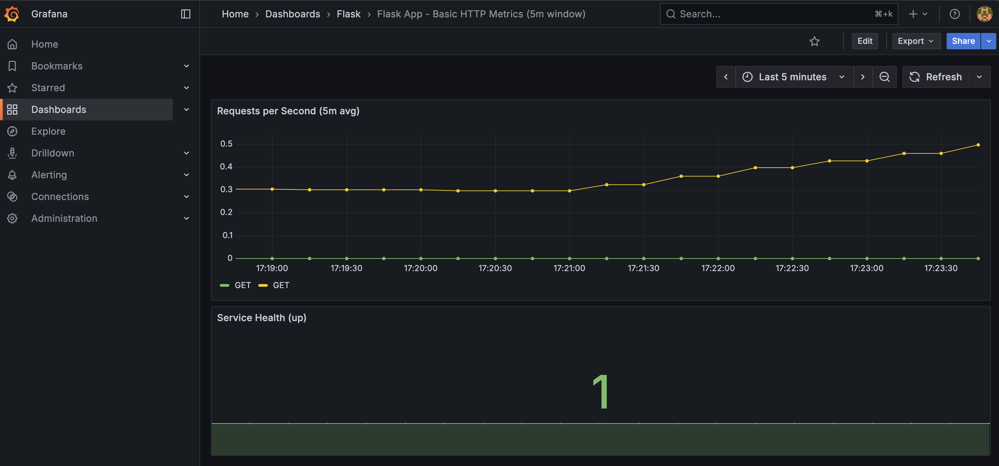

# SRE Demo Platform

A lightweight, end-to-end **DevOps / SRE showcase** running locally on Kubernetes (Kind).  
Demonstrates containerization, automation, and observability across a minimal Flask app, Prometheus metrics, and Grafana dashboards.

---

## Stack Overview

| Component | Purpose |
|------------|----------|
| **Flask App** | Example microservice exposing `/healthz`, `/compute`, and `/metrics` |
| **Prometheus** | Metrics collection |
| **Grafana** | Visualization for Prometheus metrics |
| **Ingress NGINX** | Routing for all services |
| **Kind** | Local single-node cluster |
| **Makefile** | Automation for cluster lifecycle |

---

## Prerequisites

Tested on **Ubuntu 24.04 in UTM (arm64)**.

On your VM run the setup script:
```
./setup.sh
```

## Quick Start
```
make init; make deploy-all
```

### Verify
```
make test-all
```

```
make test-all
Waiting for ingress-nginx-controller to be ready...
kubectl rollout status deployment/ingress-nginx-controller -n ingress-nginx
deployment "ingress-nginx-controller" successfully rolled out
Waiting for flask-demo pods to be ready...
kubectl rollout status deployment/flask-demo -n demo
deployment "flask-demo" successfully rolled out
Testing app via Ingress on http://localhost/app
✔ /healthz passed
✔ /compute passed
✔ /metrics passed
Checking Prometheus scrape status for flask-demo...
✔ Prometheus is scraping flask-demo (up=1)
Checking Grafana health...
✔ Grafana is healthy
All tests executed!
```


Open the endpoints in your browser:
```
http://[IP]/app/healthz
http://[IP]/prometheus
http://[IP]/grafana (admin / admin)
```

